## Task 1

### 1.1 command "printenv PWD"  /  "env | grep PWD"

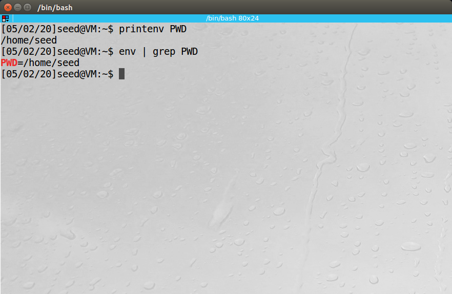

### 1.2 command "export" & "unset"

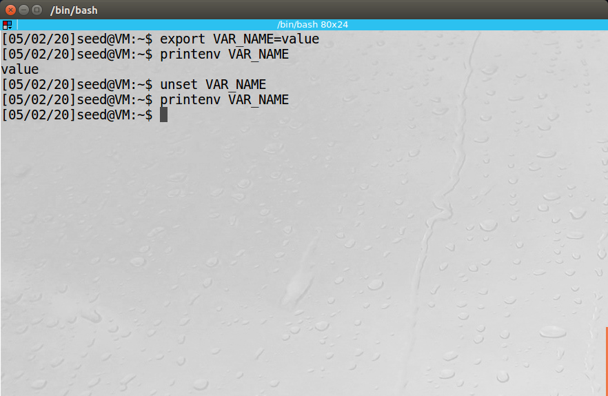

## Task 2 

### 2.1 program

```c
#include<unistd.h>
#include<stdio.h>
#include<stdlib.h>

extern char **environ;

void printenv()
{
    int i = 0;
    while(environ[i] != NULL) {
        printf("%s\n", environ[i]);
        i++;
    }
}

void main()
{
    pid_t childPid;
    
    switch(childPid = fork()) {
        case 0:    // child process
            printenv();
            exit(0);
        default:   // parent process
            // printenv();
            exit(0);
    }
}
```

### 2.2 compare the difference

```powershell
[05/03/20]seed@VM:~/HW$ task2>child
[05/03/20]seed@VM:~/HW$ task2_p>parent
[05/03/20]seed@VM:~/HW$ ls
child  parent  task2  task2.c  task2_p
[05/03/20]seed@VM:~/HW$ diff child parent
71c71
< _=./task2
---
> _=./task2_p
```

### 2.3 conclusion

The parent’s environment variables are inherited by the child process.

## Task 3

### 3.1 command & result

```powershell
[05/03/20]seed@VM:~/HW/Lab1$ gedit task3.c
[05/03/20]seed@VM:~/HW/Lab1$ gcc task3.c -o task3
[05/03/20]seed@VM:~/HW/Lab1$ task3 > task3_1
[05/03/20]seed@VM:~/HW/Lab1$ gedit task3.c
[05/03/20]seed@VM:~/HW/Lab1$ gcc task3.c -o task3
[05/03/20]seed@VM:~/HW/Lab1$ task3 > task3_2
[05/03/20]seed@VM:~/HW/Lab1$ diff task3_1 task3_2
0a1,72
> XDG_VTNR=7
> ORBIT_SOCKETDIR=/tmp/orbit-seed
> XDG_SESSION_ID=c1
> XDG_GREETER_DATA_DIR=/var/lib/lightdm-data/seed
> TERMINATOR_UUID=urn:uuid:e37c4fcb-e251-430f-a4a9-bb8b861b106a
> IBUS_DISABLE_SNOOPER=1
> CLUTTER_IM_MODULE=xim
> ANDROID_HOME=/home/seed/android/android-sdk-linux
> GPG_AGENT_INFO=/home/seed/.gnupg/S.gpg-agent:0:1
> TERM=xterm
> SHELL=/bin/bash
> DERBY_HOME=/usr/lib/jvm/java-8-oracle/db
> QT_LINUX_ACCESSIBILITY_ALWAYS_ON=1
> LD_PRELOAD=/home/seed/lib/boost/libboost_program_options.so.1.64.0:/home/seed/lib/boost/libboost_filesystem.so.1.64.0:/home/seed/lib/boost/libboost_system.so.1.64.0
> WINDOWID=60817412
> UPSTART_SESSION=unix:abstract=/com/ubuntu/upstart-session/1000/1322
> GNOME_KEYRING_CONTROL=
> GTK_MODULES=gail:atk-bridge:unity-gtk-module
> USER=seed
> LS_COLORS=rs=0:di=01;34:ln=01;36:mh=00:pi=40;33:so=01;35:do=01;35:bd=40;33;01:cd=40;33;01:or=40;31;01:mi=00:su=37;41:sg=30;43:ca=30;41:tw=30;42:ow=34;42:st=37;44:ex=01;32:*.tar=01;31:*.tgz=01;31:*.arc=01;31:*.arj=01;31:*.taz=01;31:*.lha=01;31:*.lz4=01;31:*.lzh=01;31:*.lzma=01;31:*.tlz=01;31:*.txz=01;31:*.tzo=01;31:*.t7z=01;31:*.zip=01;31:*.z=01;31:*.Z=01;31:*.dz=01;31:*.gz=01;31:*.lrz=01;31:*.lz=01;31:*.lzo=01;31:*.xz=01;31:*.bz2=01;31:*.bz=01;31:*.tbz=01;31:*.tbz2=01;31:*.tz=01;31:*.deb=01;31:*.rpm=01;31:*.jar=01;31:*.war=01;31:*.ear=01;31:*.sar=01;31:*.rar=01;31:*.alz=01;31:*.ace=01;31:*.zoo=01;31:*.cpio=01;31:*.7z=01;31:*.rz=01;31:*.cab=01;31:*.jpg=01;35:*.jpeg=01;35:*.gif=01;35:*.bmp=01;35:*.pbm=01;35:*.pgm=01;35:*.ppm=01;35:*.tga=01;35:*.xbm=01;35:*.xpm=01;35:*.tif=01;35:*.tiff=01;35:*.png=01;35:*.svg=01;35:*.svgz=01;35:*.mng=01;35:*.pcx=01;35:*.mov=01;35:*.mpg=01;35:*.mpeg=01;35:*.m2v=01;35:*.mkv=01;35:*.webm=01;35:*.ogm=01;35:*.mp4=01;35:*.m4v=01;35:*.mp4v=01;35:*.vob=01;35:*.qt=01;35:*.nuv=01;35:*.wmv=01;35:*.asf=01;35:*.rm=01;35:*.rmvb=01;35:*.flc=01;35:*.avi=01;35:*.fli=01;35:*.flv=01;35:*.gl=01;35:*.dl=01;35:*.xcf=01;35:*.xwd=01;35:*.yuv=01;35:*.cgm=01;35:*.emf=01;35:*.ogv=01;35:*.ogx=01;35:*.aac=00;36:*.au=00;36:*.flac=00;36:*.m4a=00;36:*.mid=00;36:*.midi=00;36:*.mka=00;36:*.mp3=00;36:*.mpc=00;36:*.ogg=00;36:*.ra=00;36:*.wav=00;36:*.oga=00;36:*.opus=00;36:*.spx=00;36:*.xspf=00;36:
> QT_ACCESSIBILITY=1
> LD_LIBRARY_PATH=/home/seed/source/boost_1_64_0/stage/lib:/home/seed/source/boost_1_64_0/stage/lib:
> XDG_SESSION_PATH=/org/freedesktop/DisplayManager/Session0
> XDG_SEAT_PATH=/org/freedesktop/DisplayManager/Seat0
> SSH_AUTH_SOCK=/run/user/1000/keyring/ssh
> DEFAULTS_PATH=/usr/share/gconf/ubuntu.default.path
> XDG_CONFIG_DIRS=/etc/xdg/xdg-ubuntu:/usr/share/upstart/xdg:/etc/xdg
> DESKTOP_SESSION=ubuntu
> PATH=/home/seed/bin:/usr/local/sbin:/usr/local/bin:/usr/sbin:/usr/bin:/sbin:/bin:/usr/games:/usr/local/games:.:/snap/bin:/usr/lib/jvm/java-8-oracle/bin:/usr/lib/jvm/java-8-oracle/db/bin:/usr/lib/jvm/java-8-oracle/jre/bin:/home/seed/android/android-sdk-linux/tools:/home/seed/android/android-sdk-linux/platform-tools:/home/seed/android/android-ndk/android-ndk-r8d:/home/seed/.local/bin
> QT_IM_MODULE=ibus
> QT_QPA_PLATFORMTHEME=appmenu-qt5
> XDG_SESSION_TYPE=x11
> PWD=/home/seed/HW/Lab1
> JOB=gnome-session
> XMODIFIERS=@im=ibus
> JAVA_HOME=/usr/lib/jvm/java-8-oracle
> GNOME_KEYRING_PID=
> LANG=en_US.UTF-8
> GDM_LANG=en_US
> MANDATORY_PATH=/usr/share/gconf/ubuntu.mandatory.path
> COMPIZ_CONFIG_PROFILE=ubuntu
> IM_CONFIG_PHASE=1
> GDMSESSION=ubuntu
> SESSIONTYPE=gnome-session
> GTK2_MODULES=overlay-scrollbar
> SHLVL=1
> HOME=/home/seed
> XDG_SEAT=seat0
> LANGUAGE=en_US
> LIBGL_ALWAYS_SOFTWARE=1
> GNOME_DESKTOP_SESSION_ID=this-is-deprecated
> UPSTART_INSTANCE=
> XDG_SESSION_DESKTOP=ubuntu
> UPSTART_EVENTS=started starting
> LOGNAME=seed
> DBUS_SESSION_BUS_ADDRESS=unix:abstract=/tmp/dbus-wNiWhHELqD
> J2SDKDIR=/usr/lib/jvm/java-8-oracle
> XDG_DATA_DIRS=/usr/share/ubuntu:/usr/share/gnome:/usr/local/share/:/usr/share/:/var/lib/snapd/desktop
> QT4_IM_MODULE=xim
> LESSOPEN=| /usr/bin/lesspipe %s
> INSTANCE=Unity
> UPSTART_JOB=unity-settings-daemon
> XDG_RUNTIME_DIR=/run/user/1000
> DISPLAY=:0
> XDG_CURRENT_DESKTOP=Unity
> GTK_IM_MODULE=ibus
> J2REDIR=/usr/lib/jvm/java-8-oracle/jre
> LESSCLOSE=/usr/bin/lesspipe %s %s
> XAUTHORITY=/home/seed/.Xauthority
> COLORTERM=gnome-terminal
> _=./task3
> OLDPWD=/home/seed/HW
```

### 3.2 conclusion

Environment variables are not automatically inherited by the new program.

## Task 4
```c
#include <stdio.h>
#include <stdlib.h>
int main()
{
        system("/usr/bin/env");
        return 0;
}
```
仅截取部分结果
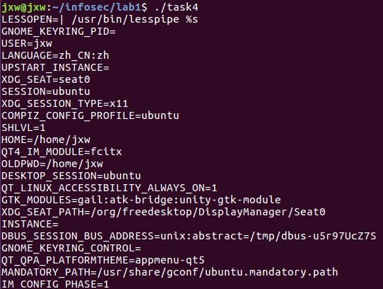

## Task 5
### Step 1. Write the following program that can print out all the environment variables in the current process.
```c
#include <stdio.h>
#include <stdlib.h>

extern char **environ;

void main()
{
        int i = 0;
        while(environ[i] != NULL)
        {
                printf("%s\n",environ[i]);
                i++;
        }
}
```
### Step 2&3. Compile the above program, change its ownership to root, and make it a Set-UID program. In your shell, use theexportcommand to set the following environment variables.
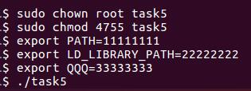

PATH和自定义的环境变量QQQ被传入子进程，LD_LIBRARY_PATH未找到


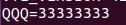

## Task 6
```c
#include <stdlib.h>
#include <unistd.h>
int main()
{
        system("ls");
        return 0;
}

```
先将编译出的task6设为root和SET-UID
随后将`/bin/sh`复制到当前目录，重命名为ls
修改环境变量`PATH`，在最前方加入当前目录
运行task6，在运行到`system("ls");`的时候，根据PATH将默认从当前目录寻找文件`ls`，即复制后的`/bin/sh`
随后会创建子进程的shell，在子进程中查看uid，发现并没有变成root
说明16.04对此有一定的保护措施
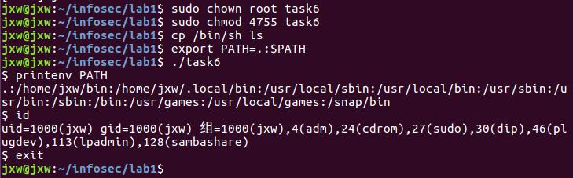

## Task 7

#### step1


#### step2

- Make myprog a regular program, and run it as a normal user.

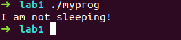

- Make myprog a Set-UID root program, and run it as a normal user.

  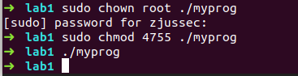

- Make myprog a Set-UID root program, export the LD PRELOAD environment variable again in the root account and run it.

  

-  Make myprog a Set-UID user1 program (i.e., the owner is user1, which is another user account), export the LD PRELOAD environment variable again in a different user’s account (not-root user) and run it.

  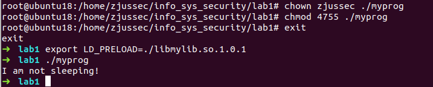

#### step 3

这个主要的问题在于动态链接器实施了一些对策，当一个进程的 RUID 和 EUID 不同的时候（上一步骤中第二个条件），动态链接器会并不会继承环境变量中的 LD_PRELOAD 和LD_LIBRARY_PATH 等变量。

设计实验如下：

1. 首先我们复制一份 env 程序 myenv 到我们自己的工作目录 
2. 将 myenv 设置为 Set-UID 程序。 
3. 在当前 shell 中 export 一些以 LD_.*的环境变量 
4. 分别运行 env 和 myenv，查看输出结果 

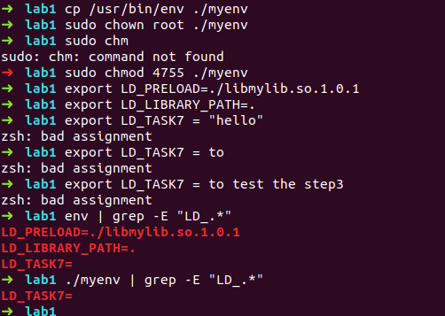

## Task 8

#### step1

system() 函数实际执行会首先打开一个 shell 来执行后面的指令，那么只要我们让我们输入的内容
中包含一条指令就可以了。Linux 中一行中执行多条命令可以用“；”隔开，这样无论前一条指
令运行的结果如何都会执行后面的指令。 

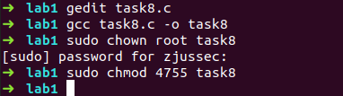

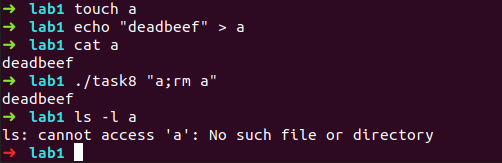

#### step2

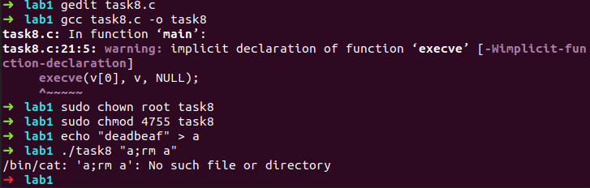

可以看到输出显示的是找不到文件“a;rm a”，避免了 step1 中的攻击。
这主要是因为 exec 系列的命令并不会像 system 一样先打开一个 shell 在执行相应的指令。
exec 系列的指令在创建完子进程以后，会将目标指令进程的上下文替代子进程的上下文，
这样子进程就成为了一个专门执行某个命令的进程。 

## Task 9

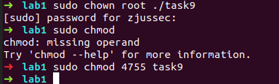

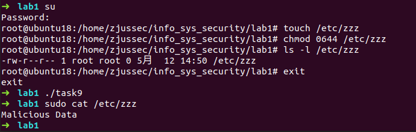

可以看到文件`/etc/zzz` 中被写入了恶意数据。

原因： 文件指针 fd 被一个 root 所有的 Set-UID 程序打开，因此具有操作文件
的能力，而这个 fd 在使用 folk()创建子进程的时候被继承到子进程中，虽然之后通过 setuid()
来降低了权限，但是子进程还是可以通过这个 fd 来修改文件。 