# Spectre Attack Lab 

##  Tasks1：Reading from Cache versus from Memory 

As you can see, the access of array[3\*4096] and array[7\*4096] faster than that of the other elements.

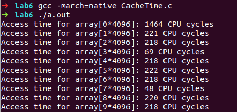

After run 10 times, actually I run 11 times. I find  that there are 3 times that the access of array[3\*4096] and array[7\*4096] is not so faster than others. The screenshot is following:

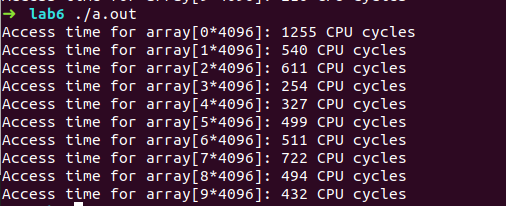

Except for the three cases, we can find the largest number for accessing the array[3\*4096] and array[7\*4096] is around  70 cycles.  So let's set the threshold be 100 cycles.

## Task2: Using Cache as a Side Channel

With the threshold is set to be 100, I run the program for 22 times and failed only 2 times. 

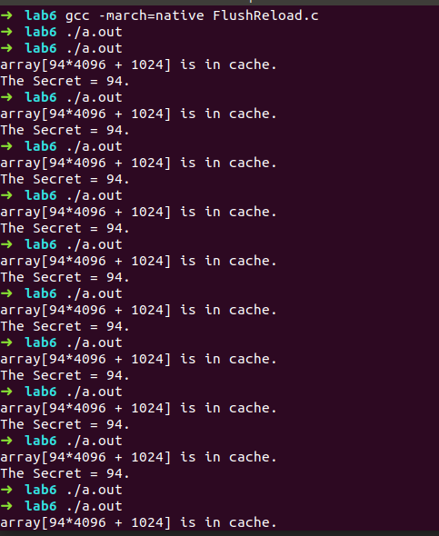

With the threshold is set to be 80, I run the program for 22 times and failed 3 times. 

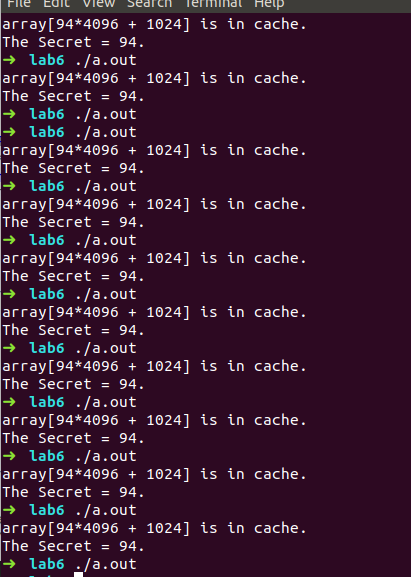

## Task3: Out-of-Order Execution and Branch Prediction

With the threshold is 80, we can find array[97*4096 + 1024] has been loaded in the cache.

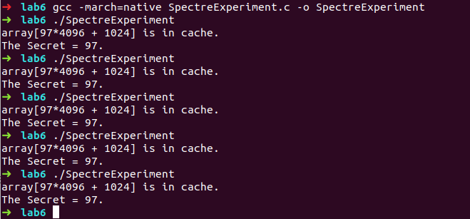

After comment the  out the lines marked with \*, we find the program cannot get the secret.

There is a much less chance in guessing the right secret. Since if the content is not flushed from the cache, CPU doesn’t have to run out-of-order.

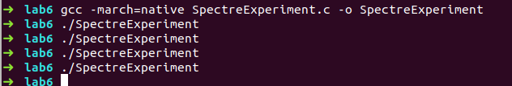

Replacing Line 4 with victim(i + 20); will cause the same output as commenting out the lines with \*. Since CPU is taught to go the false branch. And it would go to false branch for 97 as well.

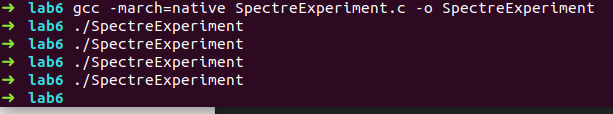

## Task4: The Spectre Attack

Most of the time, the output is 83, which is the ascii code for S, but sometimes it will output 0.  So, we have stolen the secret value.

The reason for so many 0s lies in the code below, if the CPU went to the true branch, it will output 0.

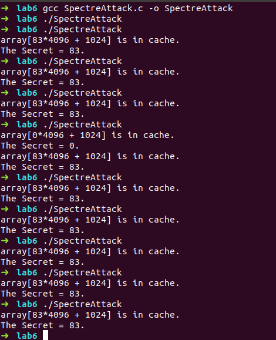

## Task 5: Improve the Attack Accuracy

You can see that the output is more likely to be 0 rather than 83. 

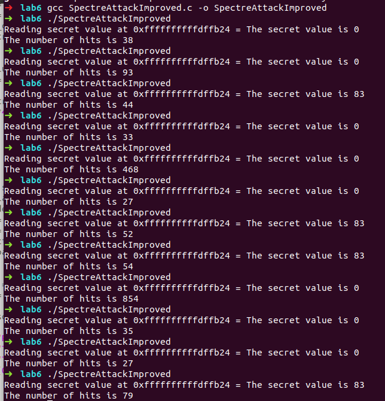

In order to figure out the reason, I added the code as below.

```c
for (i = 0; i < 256; i++) {
    if(scores[i])
    	printf("%d:%d\n",i,scores[i]);
    if (scores[max] < scores[i]) max = i;
}

```

Now, we can find that our goal is either the 2nd largest or the largest one. 

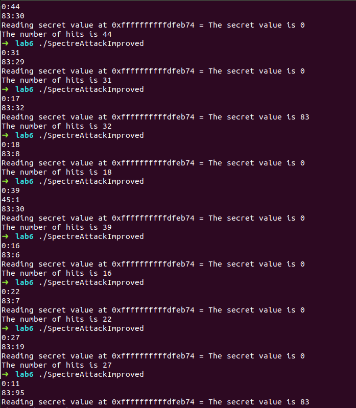

Because when the loop execute too fast, it will lead to race condition, and hence get a wrong answer. So, we can add a usleep() to slow down the loop.

```c
for (i=0; i < 1000; i++)
{
	spectreAttack(larger_x);
	reloadSideChannelImproved();
	usleep(1000);
}
```

Now, the improved version would output the right value most of the time.

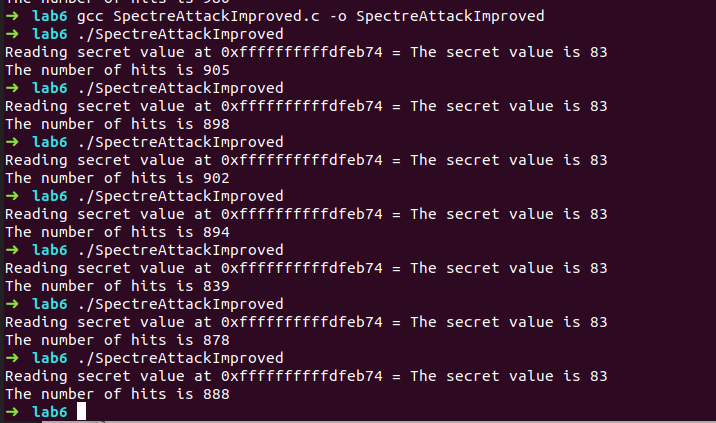

## Task 6: Steal the Entire Secret String

We only need to change main function. I post the code here.

```c
int main(int argc, char** argv)
{
    int i; 
    uint8_t s; 
    size_t larger_x = (size_t)(secret-(char*)buffer); 
    flushSideChannel();
    while(1){
        for (i = 0; i < 256; i++) scores[i] = 0; 
        for (i = 0; i < 1000; i++) { 
            spectreAttack(larger_x); 
            reloadSideChannelImproved(); 
            usleep(1000);
        }

        int max = 0;  
        for (i = 0; i < 256; i++)
        { 
            if(scores[max] < scores[i]) max = i; 
        }
        if (max<=128 && max >=-127)
            printf("%c",max);
    //printf("The secret value is %d\n", max); 
    //printf("The number of hits is %d\n", scores[max]); 
        larger_x++;
        if (max == 0)
            break;
    }
    return (0);

}
```

And the figure is the output. 

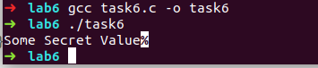

