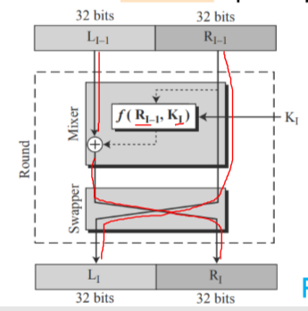
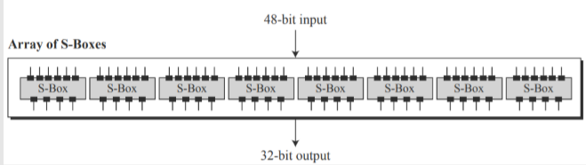
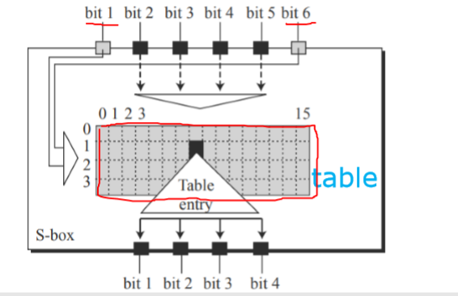

# 《网络安全原理与实践》课程期末考查答卷

## 一、

1.  A
2. C
3. B
4. D
5. B

6. B
7. B
8. A
9. B
10. C

11. D
12. A  
13. B
14. B
15. D

16. B
17. D
18. B
19. C
20. A

21. C
22. B
23. B
24. B 

25. C

## 二

#### (1). What is the key difference between symmetric cryptography and asymmetric cryptography?   Given that either of them can protect security, why should we still need both of them?   Accordingly, how are they usually used in combination?

symmetric cryptography use the same key to encrypt and decrypt, while asymmetric cryptography use different key in decryption and encryption. 

The transmission of keys is a problem when using symmetric encryption. People cannot find a secure channel to convey their key. While asymmetric cryptography doesn't need this channel since it doesn't need key transmission. However, the cost of asymmetric cryptography is large and it's unpractical to apply it into Large length plaintext encryption. While symmetric cryptography has relative low cost in encryption. 

So, we usually use asymmetric cryptography to transmits the symmetric key and then use the symmetric key to encrypt the messages we need to convey. 

#### (2). Provide an example to showcase how a DNS hijacking attack works.  

For example, you want to access the www.baidu.com, but you don't know its IP address. So you ask the DNS server. The true server will tell you that its IP address is 36.152.44.96. However, the fake DNS server will tell you an IP address where attacker deploy a phishing website which may endanger user info security.

#### (3). Describe the two critical techniques that can be cointly used to protect network communication against replay attacks.   How do they mitigate replay attacks in combination?  What are their respective limitations?

- Timestamp

  add a timestamp into the message, which is equal to the time when the message sent. And the receiver can compare the timestamp with the current time and if the difference is too large. receiver invalid the message. 

  limitation: Since, we need a threshold to judge the difference, if the attacker hijack the message and replay it very quickly, the method may fail.

- One-time session key 

  One-time session key means that a session key is only used once, to ensure that the session key used in each authentication is different. Using the one-time session key authentication mechanism, the sender and the verifier need to have a random session key together and keep synchronization at a certain position of the string. The two parties also need to use a random sequence generator together to keep synchronization at the initial state of the sequence generator, and at the same time, keep synchronization of the two parties' clocks.

  limitation: the "set" storing random numbers will become larger and larger, and the time-consuming to verify whether the one-time session key exists in the "set" will become longer and longer. We can't make the onetime session key "set" infinite, so we need to clean up the "set" regularly, but once the "set" is cleaned up, we can't verify the cleaned key parameter. That is to say, if the "set" is cleaned up once a day on average, the URL we grab can't be replayed at that time, but we can still do replays next day. In addition, the key parameter of all requests stored within 24 hours is also a considerable overhead. 

mitigate replay attacks in combination:

We add the one-time session key parameter on the basis of the timestamp method. Because the timestamp parameter is illegal for requests over the specified time, for example, 30s, we only need to store the "set" of key parameters for 30s. In this way, replay attack within 30s can be guaranteed by one-time session key, and replay attack beyond 30s can be guaranteed by timestamp.

The combination can prevent the replay attack. 

## 三

#### (1). Describe an attack scenario of a relay attack over wireless communication. Use illustration to ease the explanation if necessary. 

1. The attack starts at a fake payment terminal or a genuine one that has been hacked, where an unsuspecting victim (Alice ) uses their genuine contactless card to pay for an item.
2. Meanwhile, a criminal (Carol) uses a fake card to pay for an item at a genuine payment terminal. 
3. The genuine terminal responds to the fake card by sending a request to Carol;s card for authentication.
4. Pretty much at the same time, the hacked terminal sends a request to Alice card for authentication.
5. Alice's genuine card responds by sending its credentials to the hacked terminal.
6. The hacked terminal sends Alice's credentials to Carol's card.
7. Coral's card relays these credentials to the genuine terminal.

#### (2). How does the distance bounding protocol protect wireless communication against a relay attack?        What is the limitation of distance bounding? 

The technique of distance bounding could prevent the risk of relay attacks on contactless cards by measuring how long a card takes to respond to a request from a terminal for identification. Since information cannot travel faster than the speed of light, the maximum distance between card and terminal can be calculated. By carefully designing the communication method cards use, this estimate can be made very accurate and ensure that relay attacks over even short distances (around 10m for our prototype) are detected.

limitation: the attack can still work if the distance is small. Because it's hard to distinguish attacker added RTT and the delay caused by normal network fluctuation.

## 四

#### (1). How does blockchain address double spending? 

When miners pull the transactions simultaneously from the pool, then whichever transaction gets the maximum number of confirmations from the network will be included in the blockchain, and the other one will be discarded.
“Confirmations” are nothing but more blocks containing more transactions being added to the blockchain. Each transaction and blocks are mathematically related to the previous one. All these confirmations and transactions are time-stamped on the blockchain, making them irreversible and impossible to tamper with. It is recommended for merchants to wait for a minimum of 6 confirmations. Because to be able to double spend that coin, the sender has to go back and reverse all transactions in the 6 blocks that have been added after their transaction, **which is computationally impossible**. 

#### (2). What is the difference between proof of work and proof of stake? 

- proof of work

  make validating a block computationally costly; require enormous computation power to forge;

  In bitcoin, the miner who solve the problem firstly can be the creator of a block.

- proof of stake

  Every participant joins blockchain by paying stake
  When choosing creator of a block, more stake with high probability Creator gets stake reward if created block passes verification, otherwise, penalty
  Only one creator per block; no huge computation waste.

## 五

#### (1). Given the four important fields in a certificate (Domain Name, Public Key, CA Name, and CA Signature), please describe the process of how to verify the certificate. (Note that additional information/certificate might be used for verification.) 

1. The certificate must be issued by a trusted Certificate Authority (CA). 
2. The fully qualified hostname in the HTTPS request URL and the certificate owner (“Issued to” name) must match.
3. The certificate must be current (within its “Valid from...to...” date range). 
4. The certificate must not be on a revocation list (either CRL or OCSP). 
5. Checks 1-4 are recursively applied to every certificate in the trust chain.

#### (2). What are the two ways for a client to know whether a certificate is revoked or not?        What are the security drawback of Certificate Revocation List (CRL)-based validity check? 

- Periodically issued by a CRL issuer

  CRL is the certificate revocation list. After the certificate is revoked, it will be recorded in CRL, and CA will publish CRL regularly. Applications can rely on CRL to check if the certificate has been revoked.

- Query supported as well

  OCSP is an online certificate status checking protocol. The application sends a request according to the standard, queries a certificate, and then the server returns the certificate status.

Always a time gap between when a certificate is revoked and when its revocation approaches a client 

## 六

#### (1). Consider when Alice and Bob communicates via three relay routers A, B, and C using onion routing. The shared keys for Alice to communicate with A, B, and C are $k_A$, $k_B$, and $k_C$, respectively. Assume Alice plans to send a message msg to Bob. Let $E(msg)_k$ denote the encrypted msg using key k. 

Describe the content of the packet payload RECEIVED on each hop: 

| A    | $E(E(E(msg)_C)_B)_A$ |
| ---- | -------------------- |
| B    | $E(E(msg)_C)_B$      |
| C    | $E(msg)_C$           |
| Bob  | msg                  |

#### (2)  Please describe the advantage and disadvantage of anonymizing proxy. 

- Advantages

  - Easy to configure 

  - Require no active participation of receiver, which need not be aware of anonymity service 

  - Have been widely deployed on Internet

- Disadvantages 

  - Require trusted third party 

    proxy may release logs, or sell them, or blackmail sender

  -  Anonymity largely depends on the (likely unknown) location of attacker

## 七

#### (1). What is the difference between a Rogue AP and an Evil Twin AP? 

Rogue is a wireless access point that has been installed on a secure network without explicit authorization from a local admin.

Evil Twin AP is a fraudulent wireless AP that appears to be legitimate by faking the same SSID as legitimate AP.

#### (2). Describe the process of WEP encryption and decryption. 

- Encryption

  Step 1: Compute CRC for the message

  Step 2: Compute the keystream

  ​			 IV is concatenated with the key

  ​			 RC4 encryption algorithm is used on the 64 or 128 bit concatenation

  Step 3: Encrypt the plaintext

  ​			 The plaintext is XORed with the keystream to form the ciphertext

  ​			 The IV is prepended to the ciphertext

- Decryption

  Step 1: Build the keystream

  ​			 •Extract the IV from the incoming frame

  ​			 •Prepend the IV to the key

  ​			 •Use RC4 to build the keystream

  Step 2: Decrypt the plaintext and verify

  ​			 •XOR the keystream with the ciphertext

  ​			 •Verify the extracted message with the CRC

## 八

#### (1). Please draw the Feistel cipher per round with $L_{I-1}$ and $R_{I-1}$ as inputs and $L_I$ and $R_I$ as outputs.

#### (2). Please explain how S-box works in DES. 

-  48 to 32 substitution 

- Bits 1 and 6 select one row out of 4 

  Bits 2-5 select one column out of 16

